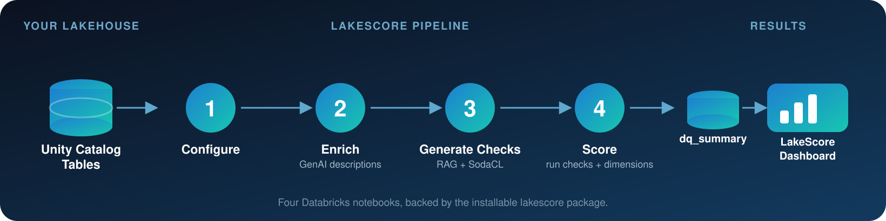

<p align="center">
  
</p>

<p align="center">
  <a href="https://github.com/issararab/Data-Quality-Framework/actions/workflows/ci.yml"></a>
  <a href="LICENSE"></a>
  
  
</p>

<p align="center">
  Stop guessing which tables you can trust. LakeScore turns every table in your Unity Catalog<br>
  into a <strong>0–100 quality score</strong> — computed automatically, explained by GenAI, and enforced with RAG-grounded checks.
</p>

---

## Contents

- [Why LakeScore](#why-lakescore)
- [How it works](#how-it-works)
- [Key features](#key-features)
- [Before you start](#before-you-start)
- [Quick start](#quick-start)
- [Quality dimensions](#quality-dimensions)
- [Documentation](#documentation)
- [Requirements](#requirements)
- [Contributing](#contributing)
- [License](#license)

---

## Why LakeScore

Lakehouses grow faster than anyone can document them. Ownership goes stale, descriptions never
get written, and quality checks — if they exist at all — live in one engineer's head. By the
time someone downstream hits a bad number, there's no fast way to tell whether the table was
ever trustworthy in the first place.

LakeScore closes that gap without asking your team to write more YAML by hand:

- **See quality at a glance.** Every table gets a single 0–100 score across 5 dimensions, so
  "is this table safe to use?" has a fast, concrete answer instead of a Slack thread.
- **Stop writing boilerplate documentation.** GenAI drafts table and column descriptions from
  the metadata that already exists — you review, you don't start from a blank page.
- **Get real checks, not guesses.** A RAG pipeline grounds check generation in actual SodaCL
  syntax pulled from a knowledge base, so generated checks are both column-appropriate and
  syntactically valid — not hallucinated YAML.
- **It runs where your data already lives.** No external service, no data leaving the
  workspace — LakeScore is a Databricks-native pipeline over Unity Catalog metadata.

## How it works

<p align="center">
  
</p>

Each stage is a thin Databricks notebook under [`notebooks/`](notebooks/) backed by the
installable [`lakescore`](src/lakescore/) package; execution order is expressed by the job DAG
in [`resources/lakescore_job.yml`](resources/lakescore_job.yml). For the full package map and
data model, see [`docs/architecture.md`](docs/architecture.md).

## Key features

| | |
|---|---|
| 🎯 **One score per table** | 5 weighted dimensions — Stewardship, Usability, Freshness, Validity, Accuracy — roll up to a single 0–100 score, color-coded Good / Okay / Poor. |
| 🤖 **GenAI metadata enrichment** | Missing table/column descriptions are drafted by an LLM from available schema metadata, tagged `has_comment` so LakeScore never regenerates one it's already handled. |
| 🔎 **RAG-grounded check generation** | Column checks are generated by an LLM retrieving real SodaCL syntax from a vector-indexed knowledge base — not free-form guesses. |
| 🏷️ **State tracked via Unity Catalog tags** | No shadow bookkeeping tables — `has_check`, `has_comment`, `has_low_cardinality` live as native column tags. |
| 🧩 **Extensible checks** | AI-generated checks and manually authored ones live side by side in `column_checks`, distinguished by tag. |
| 📦 **Deploys as a real package** | `pip install`-able, typed, tested, and CI-checked — not a folder of loose scripts. |

## Before you start

LakeScore ships with working defaults, but review these before the first run — none of them
are validated against your workspace automatically:

| Setting | Where to set it | Default | Why it matters |
|---|---|---|---|
| **`catalog_name`** | Widget on every notebook, or the `catalog_name` variable in `databricks.yml` if deploying via DAB | `"demo"` | The Unity Catalog catalog LakeScore reads from and writes its `data_quality` schema into. Must be a real catalog you have access to — nothing else works until this is right. |
| **Freshness/validity windows & low-cardinality threshold** | `dq_config` table, seeded per-table by `init_config.py`; override via `lakescore.catalog.dq_config.update_table_dq_conf_parameters` | `freshness_window="1d"`, `validity_window="1d"`, `low_cardinality_threshold=10` | These drive real scoring outcomes — a table written weekly will score `is_fresh = false` under the 1-day default. Tune per table before trusting the Freshness/Validity scores. |
| **LLM model serving endpoint** | `LAKESCORE_LLM_MODEL_ENDPOINT` environment variable on the job/cluster (falls back to a hardcoded default otherwise) | `databricks-meta-llama-3-1-70b-instruct` | Must be an endpoint that actually exists in your workspace, or GenAI description/check generation will fail outright. |
| **Vector Search endpoint & index** | `LAKESCORE_VECTOR_SEARCH_ENDPOINT` environment variable, plus the index itself | `sodacl_indexer` endpoint / `<catalog>.data_quality.knowledge_base_index` | Must be created and synced over the loaded knowledge base **before** `generate_checks.py` can run — this is manual one-time setup, not something the pipeline provisions for you. |
| **Job cluster spec** (DAB only) | `resources/lakescore_job.yml` (`spark_version`, `node_type_id`) | Databricks Runtime 15.4.x / `Standard_DS3_v2` | Only relevant if deploying via Option A below — this hasn't been validated against a live workspace; adjust to what your workspace actually supports. |

None of the above are exposed as widgets except `catalog_name` — the rest are environment
variables or code-level defaults today.

## Quick start

**Option A — Databricks Asset Bundle** (recommended)

```bash
databricks bundle validate
databricks bundle deploy -t dev
databricks bundle run lakescore_pipeline -t dev
```

Deploys `notebooks/` and runs them in order via the job in
[`resources/lakescore_job.yml`](resources/lakescore_job.yml), parameterized by the
`catalog_name` bundle variable. This scaffolding hasn't been deploy-tested against a live
workspace — review the job cluster spec first (see
[known follow-ups](docs/architecture.md#known-follow-ups-not-done-in-this-restructure)).

**Option B — Manual notebook import**

1. Clone this repo into your Databricks workspace (Repos), with `information_schema`
   available on the catalog you want to monitor.
2. Run `notebooks/init_config.py`, `update_metadata.py`, `generate_checks.py`, then
   `compute_summary.py` — in that order, setting the `catalog_name` widget on each.
3. Query `<catalog>.data_quality.dq_summary` or open the LakeScore Dashboard.

**Local development**

```bash
pip install -e ".[dev]"
pre-commit install
pytest
```

Full dev workflow: [`CONTRIBUTING.md`](CONTRIBUTING.md).

## Quality dimensions

| Dimension | Points | What it checks |
|---|---|---|
| 🏛 Stewardship | 25 | Owner, Delta format, production pipeline, retention policy, managed location |
| 📖 Usability | 15 | Table and column descriptions present |
| ⏱ Freshness | 10 | Last write within the configured window |
| ✅ Validity | 20 | Schema (columns + datatypes) unchanged vs. a past version |
| 🎯 Accuracy | 30 | Checks defined, checks passing |

Full metric-by-metric breakdown, including which `lakescore` function computes each one:
[`docs/quality_dimensions.md`](docs/quality_dimensions.md).

## Documentation

| Doc | Covers |
|---|---|
| [`docs/architecture.md`](docs/architecture.md) | Package map, functional-core design, data model, RAG flow |
| [`docs/quality_dimensions.md`](docs/quality_dimensions.md) | Full scoring taxonomy, metric-by-metric |
| [`CONTRIBUTING.md`](CONTRIBUTING.md) | Local dev setup, conventions, running checks |
| [`CHANGELOG.md`](CHANGELOG.md) | Notable changes by version |
| [Wiki](https://github.com/issararab/Data-Quality-Framework/wiki) | Configuration reference, check-authoring guide, FAQ/troubleshooting |

## Requirements

- Databricks workspace with Unity Catalog enabled, `information_schema` on monitored catalogs
- Access to a Foundation Model (LLM) endpoint and a Vector Search endpoint
- Delta Lake tables (required for the `is_delta_table` metric to pass)
- Python 3.10+ for local development (Java + PySpark/delta-spark for the integration test suite)

## Contributing

Issues and PRs welcome — see [`CONTRIBUTING.md`](CONTRIBUTING.md) for dev setup and
conventions.

## License

MIT — see [`LICENSE`](LICENSE).
