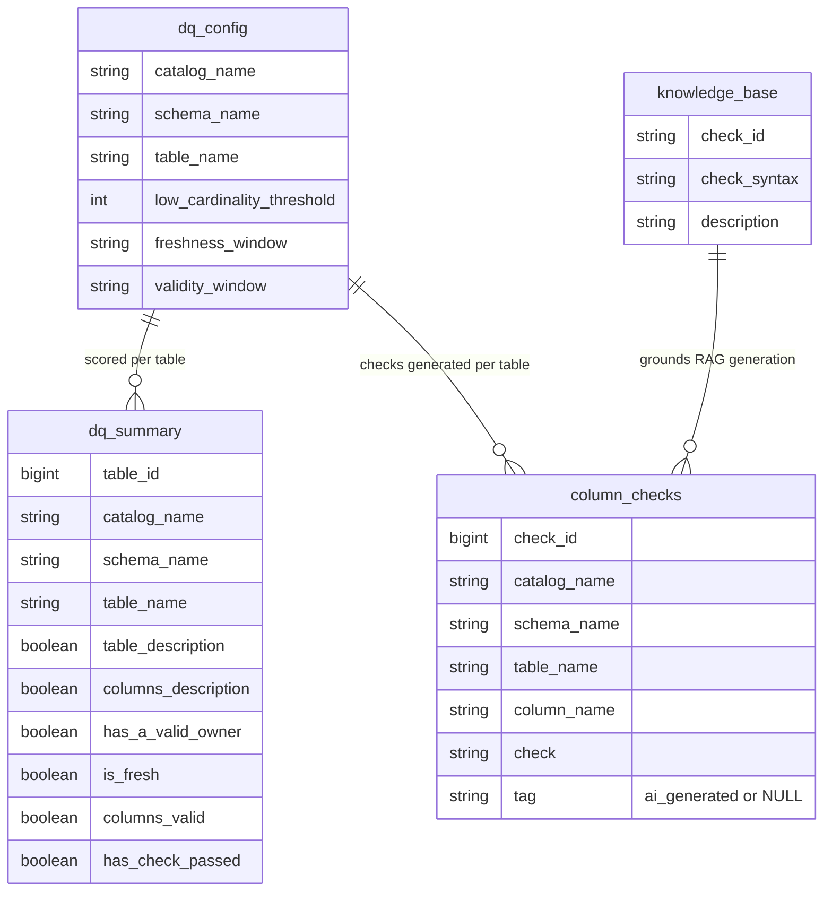

# Architecture

## Repository layout

```
lakescore/
├── src/lakescore/        # Installable package — see "Package map" below
├── notebooks/            # Thin orchestration notebooks (import from lakescore.*)
├── resources/            # Databricks Asset Bundle job definition
├── tests/                # Unit + local Spark/Delta integration tests
├── docs/                 # This file, quality_dimensions.md, assets/logo.svg
├── data/knowledge_base/  # Bundled SodaCL knowledge-base CSV
├── databricks.yml        # DAB root config
└── pyproject.toml
```

## Package map

```
src/lakescore/
├── config.py          LakeScoreConfig: catalog/endpoint/threshold settings, from widgets or env
├── sql_utils.py        escape_sql_string: the one place raw values get escaped for SQL splicing
├── soda_execution.py    renders column_checks -> SodaCL YAML, runs it via soda-core-spark-df
├── knowledge_base.py     loads the bundled SodaCL knowledge-base CSV into a Delta table
├── catalog/             DDL-ensure + CRUD, one module per LakeScore-owned table
│   ├── dq_config.py       per-table thresholds
│   ├── column_checks.py   SodaCL checks + warehouse reconciliation (sync_checks_target_table)
│   └── dq_summary.py      the scored output table
├── metadata/             read-only Unity Catalog metadata + tag mutations
│   ├── tables.py           DESCRIBE DETAIL/HISTORY/EXTENDED -> stewardship/usability signals
│   ├── columns.py          information_schema.columns/column_tags reads + comment writes
│   └── tags.py             the only place ALTER TABLE ... SET/UNSET TAGS is built
├── quality/              dimension-scoring logic
│   ├── freshness.py        threshold parsing + DESCRIBE HISTORY-based freshness check
│   ├── validity.py         schema drift vs. a past Delta version
│   └── cardinality.py      low-cardinality detection + tagging
└── generators/            GenAI chains (functional core / imperative shell)
    ├── prompts.py            prompt templates, reviewed independently of chain code
    ├── _rag_helpers.py       pure/testable retrieval + formatting logic
    ├── column_description.py thin composition root (MLflow "models from code")
    └── column_check_rag.py   thin composition root (MLflow "models from code")
```

`notebooks/` holds thin orchestration scripts that import from `lakescore.*` — they contain
looping/widget logic, not business logic. `resources/lakescore_job.yml` + `databricks.yml`
define the Databricks Asset Bundle job that runs them in order.

## Functional core, imperative shell

Every function under `catalog/`, `metadata/`, and `quality/` takes an explicit
`spark: SparkSession` argument instead of relying on the Databricks-notebook-injected global.
This is what makes `tests/integration/` possible: tests pass in a local Spark+Delta session
instead of requiring a live workspace.

`generators/` follows the same principle at a different boundary. `_rag_helpers.py` holds pure
(or Spark/mock-testable) functions; `column_description.py`/`column_check_rag.py` are thin
composition roots that build real Databricks/LangChain clients and call
`mlflow.models.set_model(...)` at module level, per MLflow's "models from code" pattern — which
requires that side effect to happen at import time, so those two files are deliberately left out
of unit-test coverage, the same way a `main.py` entrypoint would be.

## Data model



`knowledge_base` (and its vector index) is intentionally centralized in one catalog rather than
duplicated per monitored catalog — it's SodaCL reference material, not per-catalog data. See
`LakeScoreConfig.knowledge_base_table`/`vector_search_index`.

## RAG check-generation flow

```mermaid
flowchart LR
    A[Column metadata\n+ comment] --> B[extract_comment_for_retriever]
    B --> C[Vector Search\nsimilarity_search]
    C --> D[retrieve_and_format_docs]
    D --> E[format_context\nvia knowledge_base table]
    E --> F[LLM: SodaCL-grounded\ncheck generation]
    F --> G[column_checks table]
    G --> H[soda_execution.py\nexecutes checks]
    H --> I[dq_summary\nAccuracy score]
```



## Known follow-ups (not done in this restructure)

- **Parameterized queries over manual escaping.** `sql_utils.escape_sql_string` is the correct
  fix for the SQL-splicing risk it addresses, but Databricks' `spark.sql(query, args=...)`
  parameterized-query API is a strictly better long-term fix where it's supported. Its coverage
  across `ALTER TABLE ... COMMENT`/`SET TAGS` statements on your target Databricks Runtime
  wasn't verified as part of this restructure (no live workspace access) — evaluate migrating
  before relying on `escape_sql_string` indefinitely.
- **Databricks Asset Bundle scaffolding is unverified.** `databricks.yml` and
  `resources/lakescore_job.yml` were authored without a live workspace to run
  `databricks bundle validate`/`deploy` against. Review the job cluster spec
  (`spark_version`/`node_type_id`) before deploying.
- **Local integration tests need a JVM + (on Windows) `winutils.exe`.** `tests/integration/`
  starts a real local Spark+Delta session; on Windows this needs `winutils.exe` on
  `HADOOP_HOME` (see https://wiki.apache.org/hadoop/WindowsProblems), so it skips cleanly there
  rather than failing. Confirmed passing for real on Linux (both in CI and via a local WSL
  environment) — that run is what caught the `USE CATALOG`/`DeltaCatalog` delegate/missing
  `.format("delta")` bugs fixed after the first CI run on this project's PR #1.
- **`spark_catalog` stands in for an arbitrarily-named catalog in tests.** `DeltaCatalog` only
  auto-wires its internal delegate when registered under the special `spark_catalog` name —
  registering it a second time under a custom name (tried initially, to mirror Unity Catalog's
  multi-catalog naming more closely) leaves that delegate unset and breaks at the Spark
  analyzer level. `lakescore`'s own code doesn't care what the catalog is named (everything is
  fully qualified), so this doesn't reduce what's actually being tested — but it does mean
  local tests can't independently prove "an arbitrarily-named catalog also works" the way
  Unity Catalog usage in production would exercise. `spark_catalog` remains the current-catalog
  fallback for the `spark_catalog` provider only, not a general Unity Catalog stand-in.
